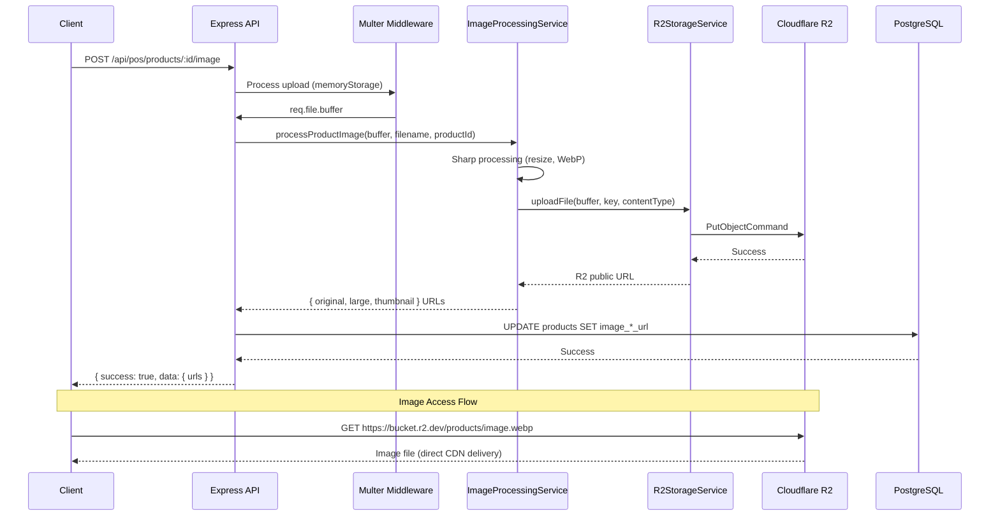
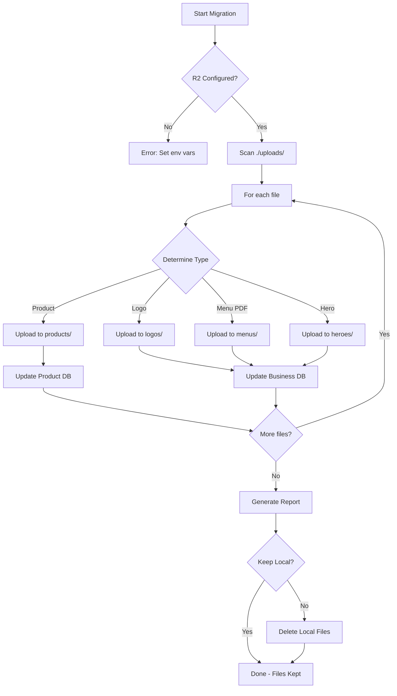

I have created the following plan after thorough exploration and analysis of the codebase. Follow the below plan verbatim. Trust the files and references. Do not re-verify what's written in the plan. Explore only when absolutely necessary. First implement all the proposed file changes and then I'll review all the changes together at the end.

## Observations

The codebase currently uses local filesystem storage for all uploads (product images, menu PDFs, logos). Product image uploads already use `memoryStorage`, but menu PDFs and logos use `diskStorage`. The `ImageProcessingService` processes images locally and returns file paths. Routes serve files directly using `res.sendFile()` or streams. Migration to Cloudflare R2 requires replacing filesystem operations with S3-compatible API calls while maintaining backward compatibility during transition.

## Approach

Implement Cloudflare R2 object storage by creating a dedicated `R2StorageService` using AWS SDK S3 client. Update all middleware to use `memoryStorage` for in-memory processing before R2 upload. Refactor `ImageProcessingService` to upload processed images to R2 and return public URLs. Update routes to redirect to R2 URLs instead of serving files locally. Create a migration script to transfer existing files from `./uploads/` to R2 and update database URLs. This approach ensures zero downtime and maintains URL compatibility.

## Implementation Steps

### 1. Install AWS SDK Dependencies

Add required packages to `file:backend/package.json`:

```json
"@aws-sdk/client-s3": "^3.700.0",
"@aws-sdk/lib-storage": "^3.700.0"
```

Run `npm install` in the backend directory.

### 2. Create R2StorageService

Create `file:backend/services/R2StorageService.js`:

**Purpose**: Centralized service for all R2 storage operations using S3-compatible API.

**Key Methods**:
- `constructor()`: Initialize S3Client with Cloudflare R2 credentials from environment variables
  - Endpoint: `https://${CLOUDFLARE_R2_ACCOUNT_ID}.r2.cloudflarestorage.com`
  - Region: `auto` (R2 requirement)
  - Credentials: `R2_ACCESS_KEY_ID`, `R2_SECRET_ACCESS_KEY`
  - Store bucket name from `R2_BUCKET` env var
  - Store public URL base from `R2_PUBLIC_URL` env var

- `uploadFile(buffer, key, contentType, metadata)`: Upload file buffer to R2
  - Use `PutObjectCommand` from `@aws-sdk/client-s3`
  - Parameters: Bucket, Key (file path), Body (buffer), ContentType, Metadata
  - Return public URL: `${R2_PUBLIC_URL}/${key}`
  - Add error handling with logger

- `uploadStream(stream, key, contentType, metadata)`: Upload large files using multipart upload
  - Use `Upload` from `@aws-sdk/lib-storage`
  - Useful for files >5MB
  - Return public URL

- `deleteFile(key)`: Delete file from R2
  - Use `DeleteObjectCommand`
  - Handle non-existent files gracefully
  - Return boolean success status

- `deleteFiles(keys)`: Batch delete multiple files
  - Use `DeleteObjectsCommand` for efficiency
  - Accept array of keys
  - Return array of results

- `getSignedUrl(key, expiresIn)`: Generate temporary signed URL (optional, for private files)
  - Use `getSignedUrl` from `@aws-sdk/s3-request-presigner`
  - Default expiration: 3600 seconds

- `fileExists(key)`: Check if file exists in R2
  - Use `HeadObjectCommand`
  - Return boolean

**Environment Variables Required**:
```
CLOUDFLARE_R2_ACCOUNT_ID=your_account_id
R2_ACCESS_KEY_ID=your_access_key
R2_SECRET_ACCESS_KEY=your_secret_key
R2_BUCKET=your_bucket_name
R2_PUBLIC_URL=https://your-bucket.r2.dev
```

**Error Handling**: Wrap all operations in try-catch, log errors using existing logger, throw descriptive errors for upstream handling.

### 3. Update ImageProcessingService for R2

Modify `file:backend/services/ImageProcessingService.js`:

**Changes to `processProductImage()` method**:
- Keep existing Sharp processing logic (resize, WebP conversion, quality settings)
- After processing each variant (original, large, thumbnail), upload buffer to R2 instead of saving to disk
- Generate R2 keys: `products/${productId}/${timestamp}_original.webp`, `products/${productId}/${timestamp}_large.webp`, `products/${productId}/${timestamp}_thumb.webp`
- Call `R2StorageService.uploadFile(buffer, key, 'image/webp', metadata)` for each variant
- Return R2 public URLs instead of local paths
- Remove local file system writes (`sharp().toFile()` → `sharp().toBuffer()`)

**Changes to `processLogoComplete()` method**:
- Process original, Google, Apple variants as buffers
- Upload each to R2: `logos/${businessId}/${timestamp}_original.ext`, `logos/${businessId}/${timestamp}_google.png`, `logos/${businessId}/${timestamp}_apple.png`
- Return R2 URLs

**Changes to `processHeroImage()` method**:
- Process hero image as buffer
- Upload to R2: `heroes/${businessId}/${timestamp}_hero.jpg`
- Return R2 URL

**Changes to `deleteProductImages()` method**:
- Extract R2 keys from URLs (parse path after `R2_PUBLIC_URL`)
- Call `R2StorageService.deleteFiles(keys)`
- Remove local filesystem delete logic

**Add new method `migrateLocalFileToR2(localPath, r2Key)`**:
- Read file from local filesystem
- Upload to R2 using `uploadFile()`
- Return R2 URL
- Used by migration script

**Backward Compatibility**: Check if `R2_BUCKET` env var is set; if not, fall back to local filesystem (for development/testing).

### 4. Update productImageUpload Middleware

Modify `file:backend/middleware/productImageUpload.js`:

**Current State**: Already uses `memoryStorage` ✅

**No changes needed** - middleware is already R2-ready since it stores files in memory (`req.file.buffer`).

### 5. Update menuPdfUpload Middleware

Modify `file:backend/middleware/menuPdfUpload.js`:

**Change storage from `diskStorage` to `memoryStorage`**:
```javascript
const storage = multer.memoryStorage()
```

**Remove `destination` and `filename` functions** - not needed with memoryStorage.

**Keep file filter and limits** - PDF validation, 10MB limit.

**Update error handling** - no changes needed.

**Impact**: `req.file` will now have `.buffer` instead of `.path`, requiring route updates.

### 6. Update logoUpload Middleware

Modify `file:backend/middleware/logoUpload.js`:

**Change storage from `diskStorage` to `memoryStorage`**:
```javascript
const storage = multer.memoryStorage()
```

**Remove `destination` and `filename` functions**.

**Keep file filter and limits** - image validation, 5MB limit.

**Impact**: `req.file` will now have `.buffer` instead of `.path`, requiring route updates.

### 7. Update Business Routes for Menu PDF

Modify `file:backend/routes/business.js`:

**POST `/my/menu-pdf` endpoint** (lines 2853-2921):
- Import `R2StorageService`
- After multer processes file, generate R2 key: `menus/${business.public_id}_menu_${timestamp}.pdf`
- Upload to R2: `await R2StorageService.uploadFile(req.file.buffer, key, 'application/pdf', { businessId: business.public_id })`
- Store R2 public URL in `business.menu_pdf_url`
- Store filename in `business.menu_pdf_filename`
- Remove local filesystem write and delete logic
- Remove cleanup of `req.file.path` (doesn't exist with memoryStorage)

**GET `/my/menu-pdf` endpoint** (lines 2924-2961):
- Instead of serving file from disk, redirect to R2 URL: `res.redirect(business.menu_pdf_url)`
- Or return JSON with URL for frontend to fetch directly
- Remove `res.sendFile()` logic

**GET `/my/menu-pdf/:filename` endpoint** (lines 2964-3003):
- Redirect to R2 URL or return 410 Gone (deprecated endpoint)
- Recommend clients use `/my/menu-pdf` instead

**DELETE `/my/menu-pdf` endpoint** (lines 3006-3048):
- Extract R2 key from `business.menu_pdf_url`
- Call `R2StorageService.deleteFile(key)`
- Clear database fields
- Remove local filesystem delete logic

**Add GET `/public/menu-pdf/:businessId` endpoint**:
- Public endpoint for menu PDF access
- Find business by `public_id`
- Redirect to `business.menu_pdf_url` (R2 public URL)
- Add caching headers

### 8. Update Business Routes for Logo

Find logo upload routes in `file:backend/routes/business.js`:

**Logo upload endpoint** (search for `logoUpload.single('logo')`):
- After multer processes file, use `ImageProcessingService.processLogoComplete(req.file.buffer, req.file.originalname)`
- Service will handle R2 upload and return URLs
- Store returned URLs in business model
- Remove local file handling

**Logo delete endpoint**:
- Extract R2 keys from stored URLs
- Call `R2StorageService.deleteFiles(keys)`
- Clear database fields

### 9. Update POS Routes for Product Images

Modify `file:backend/routes/pos.js`:

**POST `/products/:productId/image` endpoint** (lines 740-797):
- Already uses `ImageProcessingService.processProductImage()` ✅
- Service will now upload to R2 automatically
- No route changes needed - just ensure service is updated

**DELETE `/products/:productId/image` endpoint** (lines 803-858):
- Already uses `ImageProcessingService.deleteProductImages()` ✅
- Service will now delete from R2 automatically
- No route changes needed

**GET `/products/images/:filename` endpoint** (lines 864-889):
- **Option A**: Redirect to R2 URL (requires lookup or URL pattern)
- **Option B**: Return 410 Gone and update frontend to use R2 URLs directly
- **Recommended**: Redirect to `${R2_PUBLIC_URL}/products/${filename}` for backward compatibility

### 10. Create Migration Script

Create `file:backend/scripts/migrate-uploads-to-r2.js`:

**Purpose**: One-time migration of existing files from local filesystem to R2.

**Steps**:
1. Check R2 configuration (env vars present)
2. Scan `./uploads/` directory recursively
3. For each file:
   - Determine file type (product image, logo, hero, menu PDF)
   - Generate appropriate R2 key based on file location
   - Upload to R2 using `ImageProcessingService.migrateLocalFileToR2()`
   - Update database records with new R2 URLs
4. Track progress: files processed, uploaded, failed
5. Generate migration report
6. **Dry-run mode**: `--dry-run` flag to preview changes without uploading
7. **Backup mode**: `--keep-local` flag to keep local files after migration

**Database Updates**:
- Products: Update `image_original_url`, `image_large_url`, `image_thumbnail_url`
- Businesses: Update `menu_pdf_url`, logo URLs
- Use transactions for safety
- Log all URL changes

**Error Handling**:
- Continue on individual file failures
- Log errors to `migration-errors.log`
- Provide retry mechanism for failed files

**Usage**:
```bash
node backend/scripts/migrate-uploads-to-r2.js --dry-run
node backend/scripts/migrate-uploads-to-r2.js
node backend/scripts/migrate-uploads-to-r2.js --keep-local
```

### 11. Update Static File Serving Routes

Check `file:backend/server.js` or main app file for static file serving:

**Find express.static middleware** serving `/uploads` or `/designs`:
- **Option A**: Remove static serving entirely (force R2 usage)
- **Option B**: Keep for backward compatibility, add redirect middleware:
  ```javascript
  app.use('/designs/*', (req, res) => {
    const r2Url = `${process.env.R2_PUBLIC_URL}${req.path}`
    res.redirect(301, r2Url)
  })
  ```
- **Recommended**: Option B for gradual migration

### 12. Environment Configuration

Update `file:backend/.env.example` or documentation:

Add required R2 environment variables:
```
# Cloudflare R2 Object Storage
CLOUDFLARE_R2_ACCOUNT_ID=your_account_id_here
R2_ACCESS_KEY_ID=your_r2_access_key_here
R2_SECRET_ACCESS_KEY=your_r2_secret_key_here
R2_BUCKET=your_bucket_name
R2_PUBLIC_URL=https://your-bucket.r2.dev
```

**Setup Instructions**:
1. Create Cloudflare R2 bucket
2. Generate R2 API tokens (Admin Read & Write permissions)
3. Configure bucket public access (if needed) or use custom domain
4. Set CORS policy for frontend access:
   ```json
   {
     "AllowedOrigins": ["*"],
     "AllowedMethods": ["GET", "HEAD"],
     "AllowedHeaders": ["*"],
     "MaxAgeSeconds": 3600
   }
   ```

### 13. Testing & Validation

**Pre-Migration Checklist**:
- [ ] R2 bucket created and accessible
- [ ] Environment variables configured
- [ ] Test upload/download/delete with R2StorageService
- [ ] Backup existing `./uploads/` directory

**Post-Migration Validation**:
- [ ] Run migration script in dry-run mode
- [ ] Execute migration
- [ ] Verify database URLs updated
- [ ] Test product image upload/delete
- [ ] Test menu PDF upload/delete
- [ ] Test logo upload/delete
- [ ] Verify public menu access
- [ ] Check frontend image loading
- [ ] Monitor R2 storage usage

**Rollback Plan**:
- Keep local files until migration verified (use `--keep-local`)
- Database backup before URL updates
- Revert environment variables to disable R2 if issues occur

### 14. Cleanup (Post-Migration)

After successful migration and validation:

1. **Remove local files**: Delete `./uploads/` directory contents (keep directory structure for logs)
2. **Update .gitignore**: Ensure `uploads/` remains ignored
3. **Remove fallback code**: Clean up local filesystem fallback logic in ImageProcessingService
4. **Update documentation**: Document R2 setup in README
5. **Monitor costs**: Set up Cloudflare R2 usage alerts

## Architecture Diagram



## Migration Flow

