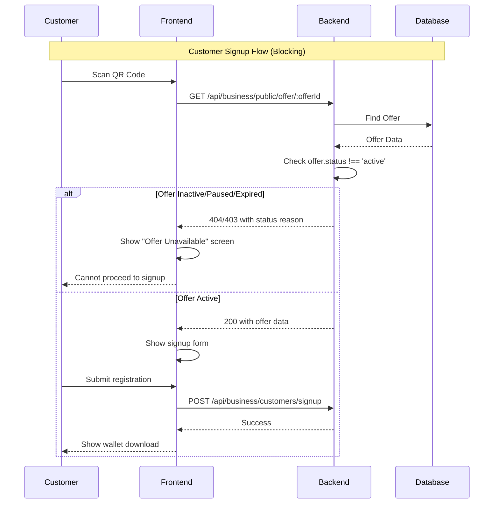
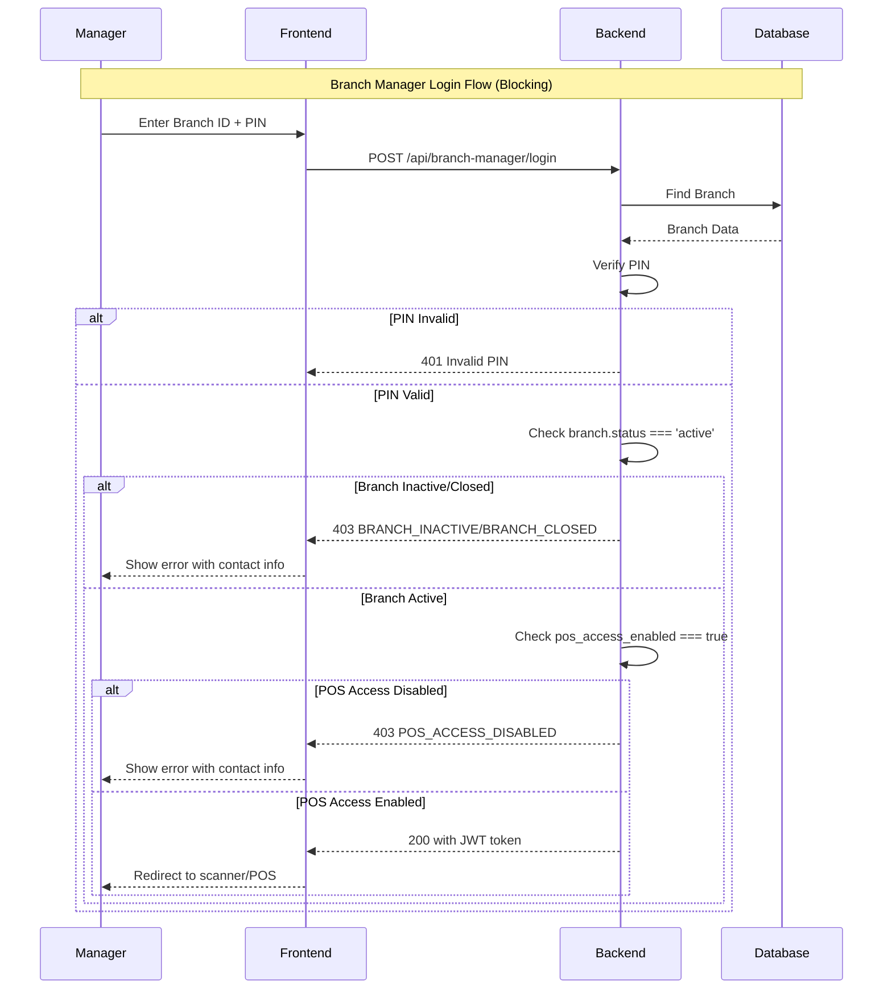
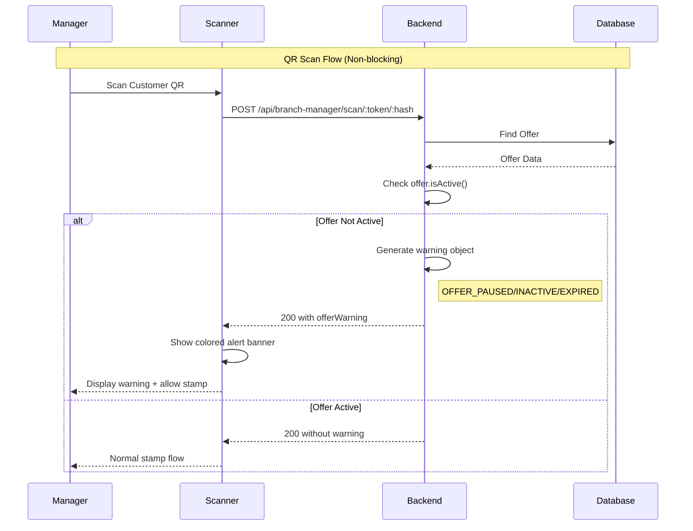

# Status Validation Documentation

## 1. Overview

The status validation system ensures that offers and branches operate within their defined lifecycles. This system prevents invalid operations (like signing up for an ended offer) while handling temporary states (like paused offers or maintenance windows) gracefully.

**Design Philosophy:**
- **Customer Signups (Blocking):** Strict validation. New customers cannot sign up for invalid offers.
- **Existing Customers (Non-Blocking):** Permissive validation. Existing customers should be able to redeem stamps even if an offer is paused (unless expired/inactive).
- **Manager Access (Blocking):** Strict validation. Managers cannot access the system if the branch is closed or deactivated.

| Validation Point | Blocking? | User Impact |
|------------------|-----------|-------------|
| Customer Signup | ✅ Yes | Cannot create account |
| Manager Login | ✅ Yes | Cannot access dashboard |
| QR Scanning | ⚠️ No | Warning shown, scan allowed |
| POS Loyalty | ⚠️ No | Warning shown, validation allowed |

---

## 2. Offer Status Validation

### Status Values
Defined in `backend/models/Offer.js`.

- **`active`**: Offer is live, visible, and operational.
- **`paused`**: Temporarily suspended. New signups blocked, but existing scanning works with warning.
- **`inactive`**: Deactivated. Neither signups nor scanning should typically happen (but scanning allows with warning).
- **`expired`**: Time-limited offer has ended. Auto-calculated based on `end_date`.

### Helper Methods
- **`isActive()`**: Returns `true` ONLY if status is 'active' AND within date range (if time-limited).
- **`isExpired()`**: Returns `true` if current date > `end_date`.

### Time-Limited Offers
Offers can be configured with:
- `is_time_limited` (boolean)
- `start_date` (timestamp)
- `end_date` (timestamp)

**Logic:** An offer is considered "Active" only if:
`status === 'active' && (!is_time_limited || (now >= start_date && now <= end_date))`

### Validation Points

#### A. Customer Signup (Blocking)
- **Location**: `src/pages/CustomerSignup.jsx`
- **Behavior**: Checks offer status before showing signup form.
- **Result**: if not active, redirects to "Offer Unavailable" screen.

#### B. QR Scanning (Non-Blocking)
- **Location**: `backend/routes/branchManager.js`
- **Behavior**: Checks status during scan.
- **Result**: Returns `200 OK` but includes `offerWarning` object if not active. Frontend displays yellow/red alert.

#### C. POS Loyalty (Non-Blocking)
- **Location**: `backend/routes/pos.js`
- **Behavior**: Similar to scanning, returns warning metadata.
- **Result**: POS shows alert but allows cashier to proceed.

---

## 3. Branch Status Validation

### Status Values
Defined in `backend/models/Branch.js`.

- **`active`**: Normal operation.
- **`inactive`**: Temporarily closed (e.g., renovation).
- **`closed`**: Permanently shut down.

### POS Access Control
New field: `pos_access_enabled` (boolean).
- **Purpose**: Allows granular control to disable POS/Scanner login while keeping the branch "Active" in the system (e.g., for system maintenance or training).
- **Default**: `true`.

### Helper Methods
- **`isOpen()`**: Returns `true` if status is 'active'.

### Validation Points

#### A. Manager Login (Blocking)
- **Location**: `backend/routes/branchManager.js`
- **Logic**:
  1. Check PIN.
  2. Check `branch.status`. If not 'active' → **403 Forbidden** (`BRANCH_INACTIVE` / `BRANCH_CLOSED`).
  3. Check `branch.pos_access_enabled`. If false → **403 Forbidden** (`POS_ACCESS_DISABLED`).

#### B. Middleware
- **Location**: `backend/middleware/branchManagerAuth.js`
- **Note**: Middleware validates the JWT token. Status checks happen primarily at **Login** time to prevent frequent database hits on every request, though critical actions may re-validate.

---

## 4. Error Codes Reference

| Error Code | HTTP Status | Trigger Condition | User Impact | Business Action |
|------------|-------------|-------------------|-------------|-----------------|
| `OFFER_PAUSED` | 200 (warning) | Offer status = 'paused' | Non-blocking warning | Resume offer or wait |
| `OFFER_INACTIVE` | 200 (warning) | Offer status = 'inactive' | Non-blocking warning | Reactivate offer |
| `OFFER_EXPIRED` | 200 (warning) | Offer status = 'expired' OR past end_date | Non-blocking warning | Create new offer |
| `OFFER_NOT_STARTED` | 200 (warning) | Before start_date | Non-blocking warning | Wait for start date |
| `OFFER_TIME_LIMITED` | 200 (info) | Active but has end_date | Informational | Plan renewal |
| `BRANCH_INACTIVE` | 403 | Branch status = 'inactive' | Login blocked | Reactivate branch |
| `BRANCH_CLOSED` | 403 | Branch status = 'closed' | Login blocked | Reopen or contact support |
| `POS_ACCESS_DISABLED` | 403 | pos_access_enabled = false | Login blocked | Enable POS access |

---

## 5. Business Logic Flows

### Customer Signup (Blocking)


### Branch Manager Login (Blocking)


### QR Scan (Non-blocking)


---

## 6. Frontend UI Patterns

- **Color Coding**: 
  - 🟡 **Yellow**: Paused
  - 🟠 **Orange**: Inactive
  - 🔴 **Red**: Expired / Closed
  - 🔵 **Blue**: Informational (Time limited)
- **Alert Components**: Reference `file:src/pages/BranchScanner.jsx` (lines 329-344) and `file:src/components/pos/CheckoutModal.jsx` (lines 648-670)
- **Internationalization**: All messages use i18n keys (e.g., `branchScanner.offerWarnings.paused`)
- **Business Contact Display**: Show business name, phone, email for branch errors

---

## 7. Database Schema

### Offers Table
```sql
CREATE TABLE offers (
  status VARCHAR(20) DEFAULT 'active' CHECK (status IN ('active', 'paused', 'inactive', 'expired')),
  is_time_limited BOOLEAN DEFAULT false,
  start_date TIMESTAMP,
  end_date TIMESTAMP,
  -- ... other fields
);
```

### Branches Table
```sql
CREATE TABLE branches (
  status VARCHAR(20) DEFAULT 'active' CHECK (status IN ('active', 'inactive', 'closed')),
  pos_access_enabled BOOLEAN DEFAULT true NOT NULL,
  manager_pin_enabled BOOLEAN DEFAULT false,
  -- ... other fields
);
```

---

## 8. Migration Guide

Reference the migration file `file:backend/migrations/20260126-add-pos-access-enabled-to-branches.js`:

```bash
# Run migration
node backend/migrations/20260126-add-pos-access-enabled-to-branches.js

# Rollback migration
node backend/migrations/20260126-add-pos-access-enabled-to-branches.js down
```

---

## 9. Troubleshooting Guide

Common issues and solutions:

| Issue | Symptom | Solution |
|-------|---------|----------|
| Customers can't sign up | "Offer not available" message | Check offer status in dashboard, ensure it's 'active' |
| Manager can't login | "Branch inactive" error | Check branch status, ensure it's 'active' and `pos_access_enabled = true` |
| Offer warnings not showing | No alerts in scanner | Check backend logs, verify `offerWarning` object in response |
| POS access disabled unexpectedly | Login blocked | Check `pos_access_enabled` field in database, toggle in dashboard |
