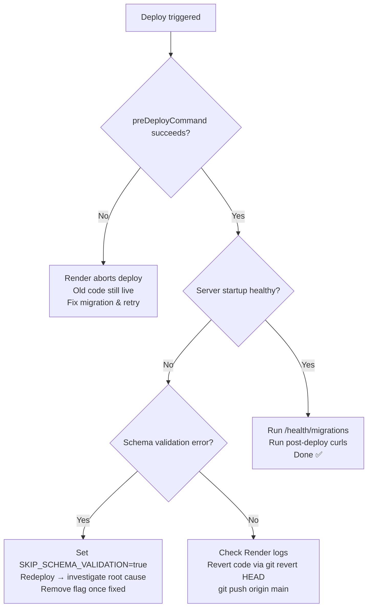

# No-Drop Migration Guide

## Introduction

A "no-drop" migration means deploying database schema changes and new code to production incrementally, without dropping or recreating the database. This is the preferred and only safe path for production environments. It ensures that existing live data—such as customers, active wallet passes, businesses, and their ongoing programs—is preserved. Dropping the production database would invalidate all existing Apple Wallet and Google Wallet passes, forcing every customer to re-enroll, which is an unacceptable user experience.

## Risk Register

| Risk | Severity | Mitigation |
|------|----------|------------|
| ENUM additions are irreversible | Medium | Test on prod copy first; accept new values persist |
| New NOT NULL columns on existing rows | High | All new columns use `DEFAULT NULL` or explicit defaults |
| Startup validation `exit(1)` | High | Use `SKIP_SCHEMA_VALIDATION=true` as emergency bypass; remove after fix |
| `campaign_type` CHECK constraint mismatch | Medium | `ALLOW_SCHEMA_DRIFT=true` logs warning instead of crash |
| Table lock during `ALTER TYPE` | Low | Deploy in low-traffic window |

## Step-by-Step Process

1. Dump prod DB schema + critical tables (`wallet_passes`, `customers`, `businesses`) using `pg_dump`.
2. Load into local test DB and run `npm run test:prod-copy` — review generated `MIGRATION_SCHEMA_DIFF_*.md`.
3. If all green, push `dev → main`; Render `preDeployCommand` runs `scripts/deploy-migrations.js` automatically.
4. Monitor Render logs for `✅ X migrations applied, 0 failed`.
5. Hit `GET /health/migrations` — confirm `pending: 0`.
6. Run post-deploy verification curl commands (wallet pass, subscription plans, messaging).

## Wallet Passes Continuity FAQ

| Question | Answer |
|----------|--------|
| Will existing Apple Wallet passes stop working? | No — `wallet_passes` table is preserved; `authentication_token` and `last_updated_tag` columns are unchanged. |
| Will existing Google Wallet passes stop working? | No — `wallet_object_id` and pass state are preserved in the DB. |
| Do customers need to re-add their passes? | No — passes update in-place via push notifications (Apple) or background sync (Google). |
| What if a migration fails mid-way? | Render aborts the deploy; old code keeps serving. No partial schema is applied because each migration is wrapped in a transaction. |
| Can I roll back ENUM additions? | No — ENUM value additions are irreversible in PostgreSQL without manual surgery. Verify on a prod copy first. |

## Rollback Decision Tree

## Cross-references
- [`docs/guides/SAFE_MIGRATION_NO_DROP.md`](SAFE_MIGRATION_NO_DROP.md) — pre-deployment checklist
- [`PRODUCTION-DEPLOYMENT.md`](../../PRODUCTION-DEPLOYMENT.md) — historical record + env var reference
- `backend/scripts/test-migrations-on-prod-copy.js` — prod copy test script
- `backend/scripts/deploy-migrations.js` — Render pre-deploy runner
